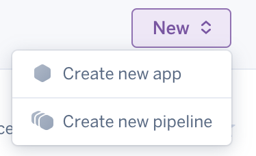
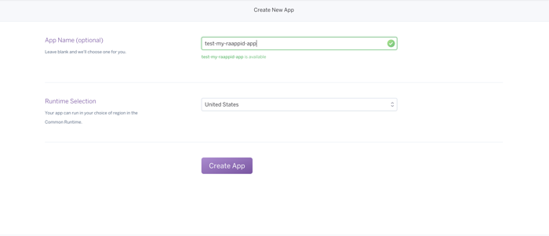
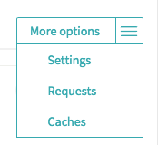
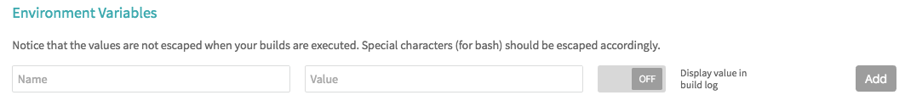
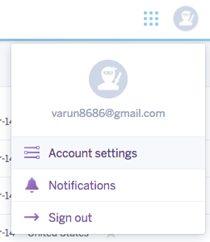

# Project deployment Guide.

#### Requirement

- Before Proceeding Further please make sure the Continuous integration is setup for you project, as CI is also used for deployment
- [Setup Continuous Integration](docs/CI.md)

#### To Deploy your Project to Heroku

1. Sign into [Heroku](https://dashboard.heroku.com/) account.

2. Click on create new button and Create new App.

    

3. In the following screen. Enter unique name for your app.

    
    
4. Setup Travis CI Environment Variables, to start deploying your application

    1. Select your project repository on Travis-CI
    
    2. Go to More Options and Click on Settings
    
        
        
    3. Scroll to Environment Variables section to start adding Necessary Environment Variables
        
            
        
    4. Add HEROKU_WEB_APP_NAME,
    
        Add the name of the app you created in Heroku.
        
        
        
    4. Add HEROKU_API_KEY
        
        
       
       1. To get Heroku Api Key, Sign into  [Heroku](https://dashboard.heroku.com/)
        
       2. Go to Account Settings
       
        
        
       3. Scroll down to API Key section, and Copy the value
       
        
        
       4. Paste the Value in the Environment Variable being created in Travis CI
       
          
        

       
       
             
